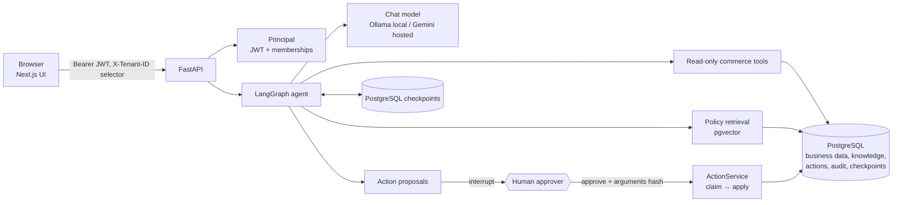
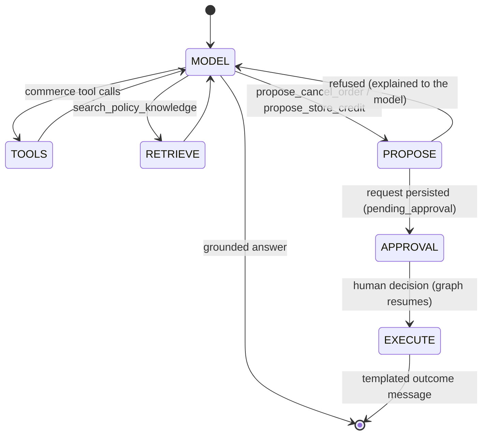

# CommerceOps AI — Ecommerce AI Operations Agent

An AI operations assistant for ecommerce teams: it answers questions about customers,
orders, invoices and shipments from the database, answers policy questions with validated
citations, and **proposes** order cancellations and store credits that a human approves
before anything changes.

> **Data notice:** everything is synthetic — two invented tenants, invented customers,
> orders and policies. No real customer or company data is used, and no real payment or
> refund provider exists (store credit is a synthetic ledger).

**Status:** complete locally (tests, e2e, deployment runbook). **Not deployed.**
See [docs/COMPLETION_STATUS.md](docs/COMPLETION_STATUS.md).

## What it does

| Capability | How |
| --- | --- |
| Exact business facts | 12 read-only, tenant-scoped tools over PostgreSQL (no RAG, no raw SQL) |
| Policy answers | pgvector semantic retrieval over a versioned policy corpus; citations validated against the chunks retrieved in the current turn, for this tenant and date |
| Actions | `cancel_order`, `issue_store_credit` — model proposes, an **approver** decides, the server re-checks and executes once (idempotency key, two-phase claim/apply) |
| Durable conversations | LangGraph with PostgreSQL checkpoints: a pending approval survives restarts and can be resumed by any API instance |
| Trusted identity | Supabase Auth JWT (JWKS) + server-side tenant memberships; `X-Tenant-ID` is only a selector |
| Auditability | `audit_events` for every action/decision, `agent_runs` for every run; no prompts or payloads in logs |
| UI | Next.js chat with citation cards, activity summary and approval cards |

## Portfolio experience

* **Try Live Demo** — no sign-up: a Supabase anonymous session gets read-only access to the
  shared synthetic BluePeak tenant ("Public Demo · Read-only"); conversations stay private
  to each visitor. Reviewer accounts keep the full human-approval flow.
* **Agent Execution Trace** — every answer shows what the run actually did, in order: graph
  steps, tools, retrieval (pgvector or full-text), grounding, approval and execution — safe
  metadata only, never prompts or model reasoning.
* **`/review`** — a public engineering case study: architecture, request flows, RAG, HITL,
  security boundaries, evaluation evidence and deployment.

## Measured results (synthetic, small — regression signals, not general claims)

* **Retrieval:** On the fixed 20-case synthetic retrieval evaluation corpus, semantic
  retrieval achieved exact-chunk hit@1 of 1.00 versus 0.40 for lexical retrieval.
* **Action evaluation harness:** 18 cases × 12 metrics (approval-before-write, tenant
  isolation, duplicate prevention, …). The deterministic oracle script scores 1.00 on every
  metric, which validates the harness and the application's guarantees; it is **not** a
  measurement of a live model's decisions.
* **Resilience:** failure injection (model, retriever, database, checkpoint store,
  mid-execution crash) — every failure ends in a stable error code and never in an
  unapproved or duplicated write.

## Architecture





Key decisions (details in [docs/architecture.md](docs/architecture.md)):

* **Facts from queries, rules from RAG.** Order totals are exact relational facts; policies
  are prose. They never trade places.
* **The model never chooses the tenant**, never sees SQL, and has no generic write, HTTP or
  file tool. Tenant comes from the verified principal as LangGraph runtime context.
* **Writes need a human.** The model can only propose; execution is deterministic
  application code bound to the arguments hash the approver saw; the outcome text is
  templated by the application, not generated.
* **Prompt-injection boundary.** Retrieved policy text is data: after a retrieval no new
  commerce tool may run in the turn, and injected text can at most create an inert pending
  request that a human sees and can reject.
* **Grounding.** A policy answer must cite chunks retrieved in the *current* turn, for the
  trusted tenant, effective on the requested date; stale or invented citations are rejected.
* **Fail closed.** Infrastructure failures become stable error codes (never "no policy
  exists"); uncertain non-idempotent writes are never retried automatically; durable
  checkpoints let an approved request resume idempotently after a crash.
* **Local vs hosted.** Ollama for local development (chat + embeddings); Gemini for the
  hosted demo. Each embedding provider/model/revision is a separate profile — vectors never
  mix.
* **One process, one database.** No Redis, queues or microservices; PostgreSQL holds business
  data, knowledge, embeddings, actions, audit and checkpoints.

## Quick start (local)

```bash
cp .env.example .env && cp backend/.env.example backend/.env && cp frontend/.env.example frontend/.env.local
docker compose up -d db
cd backend && uv sync && uv run alembic upgrade head && uv run python -m scripts.seed_demo
uv run python -m scripts.setup_checkpoints
uv run uvicorn app.main:app --reload --port 8000        # demo auth mode, local Ollama
cd ../frontend && npm ci && npm run dev                  # http://localhost:3000
```

Policy answers need `ingest_policies` + `embed_policies` (local Ollama embedding model).
No model at all? Run the **offline demo** (real stack, deterministic chat model):
[docs/DEMO_SCENARIOS.md](docs/DEMO_SCENARIOS.md). Full command reference:
[docs/DEVELOPMENT.md](docs/DEVELOPMENT.md).

## Tests

| Suite | Command | What it covers |
| --- | --- | --- |
| Backend | `uv run pytest` (with `TEST_DATABASE_URL` for real PostgreSQL) | unit + real-DB tests: tenancy, tools, retrieval, RAG grounding, actions, graph, checkpoints, auth, API, failure injection, deployment checks |
| Frontend unit | `npm test` | citation rendering, approval card, chat panel, workspace, security headers |
| Browser e2e | `npm run test:e2e` | real UI → real API → real PostgreSQL, deterministic model: lookup, citations, approve/reject, store credit, tenant separation, retry, no CSP violations |
| Mutations | see COMPLETION_STATUS | each safety property has at least one mutation that turns the suite red |

GitHub Actions ([`ci.yml`](.github/workflows/ci.yml)) runs `backend`, `frontend`, `e2e` and
`security` on every pull request and push to `main`. Deployment is native: Railway
(root `backend`) and Vercel (root `frontend`) auto-deploy `main`. See
[docs/CI_CD.md](docs/CI_CD.md).

## Documentation

| Doc | Contents |
| --- | --- |
| [architecture.md](docs/architecture.md) | design and decisions, step by step |
| [DEMO_SCENARIOS.md](docs/DEMO_SCENARIOS.md) | five demo walkthroughs |
| [DEVELOPMENT.md](docs/DEVELOPMENT.md) | setup, CLI reference, tests |
| [DEPLOYMENT.md](docs/DEPLOYMENT.md) | Railway + Supabase + Vercel runbook (not executed) |
| [CI_CD.md](docs/CI_CD.md) | GitHub Actions CI, native Railway/Vercel deploys, branch protection, rollback |
| [SECURITY.md](docs/SECURITY.md) | trust boundaries, controls, review results |
| [OBSERVABILITY.md](docs/OBSERVABILITY.md) | logs, run records, audit trail, optional LangSmith |
| [pending-items.md](docs/pending-items.md) | known limitations and follow-ups |

## Limitations

Small synthetic evaluation sets; no hybrid ranking or reranker; no streaming responses;
in-process rate limiting; thread history is not trimmed; no live Supabase/Gemini
verification was run; nothing is deployed. See [pending-items.md](docs/pending-items.md).

```
backend/   FastAPI app (api, agent, actions, auth, knowledge, observability), alembic, scripts, tests
frontend/  Next.js app (src/app, src/components/agent, src/lib), vitest tests, Playwright e2e
docs/      architecture, runbooks, reviews, status
```
