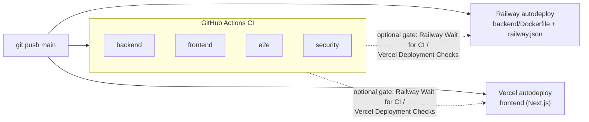

# CI/CD

```
git push main
  → GitHub Actions CI (backend, frontend, e2e, security)
  → Railway native GitHub integration deploys the backend (root directory `backend`)
  → Vercel native Git integration deploys the frontend (root directory `frontend`)
```

GitHub Actions ([`.github/workflows/ci.yml`](../.github/workflows/ci.yml)) only **tests**; it
never deploys and uses no secrets. Deployment is done by Railway and Vercel themselves when
`main` changes.



## Triggers

| Event | What runs |
| --- | --- |
| Pull request targeting `main` (incl. forks) | CI: `backend`, `frontend`, `e2e`, `security`. Vercel may build a preview deployment; Railway deploys nothing. |
| Push to `main` | CI, and in parallel Railway and Vercel production deploys |
| Manual *Run workflow* (`workflow_dispatch`) | CI only |

* **No path filters.** Every run produces the same four check names, so a required check can
  never "disappear" and block a merge. **(V)**
* **Concurrency.** A newer commit cancels obsolete CI on the same pull request; runs on `main`
  are never cancelled.
* **Permissions.** `contents: read` for the whole workflow; no job asks for more. Every
  checkout uses `persist-credentials: false`. No `pull_request_target`, no `workflow_run`, no
  secrets.

## CI jobs (stable names for branch protection)

| Job | What it runs |
| --- | --- |
| `backend` | PostgreSQL + pgvector service (`pgvector/pgvector:pg17`, the docker-compose image) → `uv sync --locked` → `uv lock --check` → `ruff format --check` → `ruff check` → `alembic upgrade head` on the **clean** database → `alembic check` (models match the migrated schema) → full `pytest` suite with `TEST_DATABASE_URL`. The suite itself runs downgrade base ↔ head round trips, so no separate downgrade job. JUnit report uploaded only on failure. |
| `frontend` | Node from `frontend/.nvmrc` (npm cache) → `npm ci` (engine-strict) → lint → typecheck → unit tests → production build, with dummy public env only (`NEXT_PUBLIC_API_URL=http://127.0.0.1:8000`, `NEXT_PUBLIC_AUTH_MODE=demo`). |
| `e2e` | Its **own** runner and PostgreSQL service (`commerceops_e2e_test`), because the harness resets its database. `uv sync --locked`, `npm ci`, `playwright install --with-deps chromium`, then `npm run test:e2e`, which starts the deterministic harness API (`tests.e2e.server`: real app, keyword chat model) and `next dev`. Traces uploaded only on failure. |
| `security` | gitleaks 8.30.1 (downloaded, SHA-256 verified) over the **full git history**; `pip-audit` on the locked runtime dependencies (`uv export --no-dev`); `npm audit --omit=dev --audit-level=high`. |

Each job has its own runner and service container, so the pytest suite and the e2e harness
never share (or reset) the same database.

### Deliberately not run in CI

* Live-provider tests (`RUN_OLLAMA_INTEGRATION`, `RUN_GEMINI_INTEGRATION`): no Ollama, no
  Gemini key — they stay **skipped** (visible in the `-rs` summary), never faked.
* Anything needing Supabase, Railway or Vercel credentials: CI has none.
* `docker build`: Railway builds the image from `backend/Dockerfile` on deploy.
* The mutation runs from `COMPLETION_STATUS.md` (developer tooling, minutes of full-suite
  runs per mutation).

## Deployment (native integrations)

### Railway — backend

* Service connected to this GitHub repository, branch `main`, **Root Directory `backend`**,
  **config file path `/backend/railway.json`** (Railway's config path does not follow the root
  directory). Autodeploy on.
* Railway builds `backend/Dockerfile`. `railway.json` runs the pre-deploy step
  `python -m scripts.predeploy` (`check_env` → `alembic upgrade head` →
  `setup_checkpoints`) before the new container receives traffic — **the only place
  migrations run**. The new release goes live only if that step succeeds and
  `GET /health/ready` passes; otherwise the previous deployment keeps serving.
* `watchPatterns: ["/backend/**"]` in `railway.json`: commits that touch only the frontend or
  docs do not redeploy the backend.

### Vercel — frontend

* Project imported from this repository, **Root Directory `frontend`**, production branch
  `main`, Node.js 22.x or 24.x. `frontend/vercel.json` contains no Git restriction, so the
  native integration deploys `main` to production and other branches as previews.
* `NEXT_PUBLIC_*` values (public only) are set in the Vercel project's environment settings;
  no server secret is ever a `NEXT_PUBLIC_*` variable.

### CI and deploys run in parallel — optional gates

With plain autodeploy, Railway and Vercel start deploying `main` at the same time as CI, so a
commit whose CI fails can still be deployed. Branch protection (below) is the primary guard:
nothing reaches `main` without a green pull request. To also stop a red `main` commit from
going live, enable (dashboard settings, no code changes):

* **Railway → service → Settings → *Wait for CI***: the deployment waits in `WAITING` until
  the GitHub Actions workflows for the commit finish, and is skipped if one fails.
* **Vercel → project → Settings → Build and Deployment → *Deployment Checks***: add the
  GitHub checks `backend`, `frontend`, `e2e`, `security`; the production build is created but
  only promoted to the production domain once they pass.

### Secrets

GitHub needs **no** secrets or deployment variables for this flow. Runtime configuration lives
in the platforms: Railway service variables (`DATABASE_URL`, `GEMINI_API_KEY`, …) and Vercel
project environment variables (`NEXT_PUBLIC_*`). Names are listed in
[DEPLOYMENT.md](DEPLOYMENT.md).

## Branch protection (recommended for `main`; not applied automatically)

* Require a pull request before merging (at least one approval recommended).
* Required status checks: **`backend`**, **`frontend`**, **`e2e`**, **`security`**.
* Require branches to be up to date before merging.
* Block force pushes; block deletion.
* Optionally: require conversation resolution and linear history; include administrators.

## Operating it

* **Re-run CI:** *Re-run jobs* on the run in *Actions*, or *Run workflow*.
* **Redeploy:** Railway — *Redeploy* on the service's latest deployment; Vercel — *Redeploy*
  on the production deployment. (A new commit on `main` redeploys automatically — the backend only when `backend/` changed.)
* **Rollback:** Railway — redeploy the previous successful deployment from the service's
  deployment list (the schema only moves forward; migrations 0004–0006 are additive, so an
  older image runs on the newer schema). Vercel — *Instant Rollback* to the previous
  production deployment. Then fix forward with a revert commit through a pull request.
* **Pause deploys:** turn off autodeploy on the Railway service / disconnect or pause the
  Vercel Git integration.
* **Bump CI tool versions:** `UV_VERSION`, `GITLEAKS_VERSION` + `GITLEAKS_SHA256`,
  `PIP_AUDIT_VERSION` in `ci.yml`.
