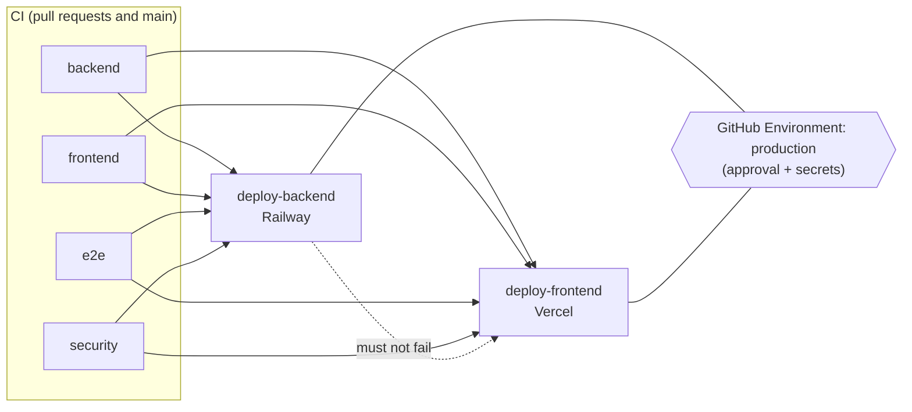

# CI/CD

One workflow, [`.github/workflows/ci.yml`](../.github/workflows/ci.yml), holds CI and the gated
deployment jobs. Nothing deploys unless a maintainer turns it on (repository variables) and
the protected `production` environment approves it. **No deployment has been run from this
repository yet.**

## Triggers

| Event | Jobs that run |
| --- | --- |
| Pull request targeting `main` (incl. forks) | `backend`, `frontend`, `e2e`, `security`. Deploy jobs are **skipped** (they never run for PRs and no deploy secret is available to them). |
| Push to `main` | the four CI jobs, then `deploy-backend` → `deploy-frontend` if enabled and approved |
| Manual *Run workflow* on `main` (`workflow_dispatch`) | same as a push: full CI first, then the gated deploys |

* **No path filters.** Every run produces the same four check names, so a required check can
  never "disappear" and block a merge. **(V)**
* **Concurrency.** A newer commit cancels obsolete CI on the same pull request. Runs on `main`
  are never cancelled; each deploy job has its own concurrency group (`deploy-production-*`),
  so two deploys never overlap and a queued older deploy is superseded by a newer one.
* **Permissions.** `contents: read` for the whole workflow; no job asks for more. Every
  checkout uses `persist-credentials: false`. No `pull_request_target`, no `workflow_run`.

## CI jobs (stable names for branch protection)

| Job | What it runs |
| --- | --- |
| `backend` | PostgreSQL + pgvector service (`pgvector/pgvector:pg17`, the docker-compose image) → `uv sync --locked` → `uv lock --check` → `ruff format --check` → `ruff check` → `alembic upgrade head` on the **clean** database → `alembic check` (models match the migrated schema) → full `pytest` suite with `TEST_DATABASE_URL`. The suite itself runs downgrade base ↔ head round trips, so no separate downgrade job. JUnit report uploaded only on failure. |
| `frontend` | Node from `frontend/.nvmrc` (npm cache) → `npm ci` (engine-strict) → lint → typecheck → unit tests → production build, with dummy public env only (`NEXT_PUBLIC_API_URL=http://127.0.0.1:8000`, `NEXT_PUBLIC_AUTH_MODE=demo`). |
| `e2e` | Its **own** runner and PostgreSQL service (`commerceops_e2e_test`), because the harness resets its database. `uv sync --locked`, `npm ci`, `playwright install --with-deps chromium`, then `npm run test:e2e`, which starts the deterministic harness API (`tests.e2e.server`: real app, keyword chat model) and `next dev`. Traces uploaded only on failure. |
| `security` | gitleaks 8.30.1 (downloaded, SHA-256 verified) over the **full git history**; `pip-audit` on the locked runtime dependencies (`uv export --no-dev`); `npm audit --omit=dev --audit-level=high`. |

Each job has its own runner and service container, so the pytest suite and the e2e harness
never share (or reset) the same database.

### Deliberately not run in CI

* Live-provider tests (`RUN_OLLAMA_INTEGRATION`, `RUN_GEMINI_INTEGRATION`): no Ollama, no
  Gemini key — they stay **skipped** (visible in the `-rs` summary), never faked.
* Anything needing Supabase, Railway or Vercel credentials (only the deploy jobs use those).
* `docker build`: Railway builds the image from `backend/Dockerfile` on deploy.
* The mutation runs from `COMPLETION_STATUS.md` (developer tooling, minutes of full-suite
  runs per mutation).

## CD design

**Choice (V):** deploy jobs live in the same workflow and `needs:` all four CI jobs of the
same run, instead of a separate `workflow_run` workflow. It is simpler, the deployed commit
is exactly the tested commit, a failed CI job skips the deploy, and there are none of the
`workflow_run` pitfalls (trusted context running for fork-triggered runs, default-branch
workflow code, lost commit linkage).

A deploy job runs only when **all** hold:

1. the ref is `refs/heads/main` and the event is `push` or `workflow_dispatch`;
2. `backend`, `frontend`, `e2e` and `security` succeeded in this run;
3. the repository variable `RAILWAY_DEPLOY_ENABLED` / `VERCEL_DEPLOY_ENABLED` is `true`
   (unset → the job shows as *skipped*, CI stays green);
4. the `production` environment's protection rules pass (required reviewers, branch rule).

`deploy-frontend` runs after `deploy-backend`; it also runs when backend CD is disabled
(skipped) but never after a failed backend deploy.

### Railway (backend)

* Reuses the existing mechanism: `backend/Dockerfile` + `backend/railway.json`. The job only
  uploads the source with the pinned Railway CLI (`railway up --ci --service …`) using an
  environment-scoped **project token**.
* **Migrations run in exactly one place:** Railway's `preDeployCommand`
  (`python -m scripts.predeploy` = `check_env` → `alembic upgrade head` →
  `setup_checkpoints`). The workflow never runs migrations.
* Railway keeps the previous deployment serving unless the pre-deploy step succeeds and the
  new container passes `GET /health/ready`. After the upload the job polls
  `$BACKEND_URL/health/ready` until it reports `ready`.
* Limitation: `railway up --ci` returns after the build; the smoke check verifies whatever
  deployment is serving. If the new release failed its pre-deploy or healthcheck, Railway
  keeps the old one live — check the deployment status in Railway.
* **Turn off Railway's own GitHub autodeploy** for this service (or don't connect the repo),
  otherwise every push deploys twice and the second path skips the approval gate.

### Vercel (frontend)

* The documented CLI pattern: `vercel pull --environment=production` → `vercel build --prod`
  → `vercel deploy --prebuilt --prod`, pinned CLI, run from the repository root (the Vercel
  project's Root Directory is `frontend`).
* Build-time `NEXT_PUBLIC_*` values come from the Vercel project's **Production**
  environment (public values only; see `DEPLOYMENT.md`). No server secret is ever a
  `NEXT_PUBLIC_*` variable.
* `frontend/vercel.json` sets `git.deploymentEnabled.main = false`: the Vercel Git integration
  may still build preview deployments for branches, but production (`main`) deploys only come
  from this gated workflow.

## GitHub configuration (names only, no values)

**Environment:** `production`, with *Required reviewers* and *Deployment branches: `main`
only*.

| Kind | Name | Scope | Used by |
| --- | --- | --- | --- |
| Secret | `RAILWAY_TOKEN` | environment `production` | deploy-backend (Railway **project token** for the production environment) |
| Secret | `VERCEL_TOKEN` | environment `production` | deploy-frontend |
| Variable | `RAILWAY_SERVICE` | environment `production` | deploy-backend (service name or id) |
| Variable | `BACKEND_URL` | environment `production` | deploy-backend smoke check, environment URL (`https://…`) |
| Variable | `VERCEL_ORG_ID` | environment `production` | deploy-frontend |
| Variable | `VERCEL_PROJECT_ID` | environment `production` | deploy-frontend |
| Variable | `FRONTEND_URL` | environment `production` | environment URL (optional) |
| Variable | `RAILWAY_DEPLOY_ENABLED` | **repository** | `true` turns backend CD on |
| Variable | `VERCEL_DEPLOY_ENABLED` | **repository** | `true` turns frontend CD on |

The enable switches are repository variables because job-level `if:` is evaluated before a job
enters its environment. Application runtime secrets (`GEMINI_API_KEY`, `DATABASE_URL`, …) are
**not** GitHub secrets: they live in Railway's service variables (see `DEPLOYMENT.md`).
CI itself needs no secret at all.

## Branch protection (recommended for `main`; not applied automatically)

* Require a pull request before merging (at least one approval recommended).
* Required status checks: **`backend`**, **`frontend`**, **`e2e`**, **`security`**.
* Require branches to be up to date before merging (the deploy runs on the merge result).
* Block force pushes; block deletion.
* Optionally: require conversation resolution and linear history; include administrators.
* Environment `production`: required reviewers, deployment branch rule `main` only.

## Operating it

* **Re-run a deploy:** in *Actions*, open the run for the commit and *Re-run failed jobs*
  (only the deploy job runs again; CI results of that run are reused), or *Run workflow* on
  `main` to test and deploy the current head again.
* **Rollback:** Railway — *Redeploy* the previous successful deployment from the service's
  deployment list (the schema only ever moves forward; migrations 0004–0006 are additive, so an
  older image runs on the newer schema). Vercel — *Instant Rollback* / promote the previous
  production deployment. Then fix forward with a revert commit through a normal pull request.
* **Pause CD:** set `RAILWAY_DEPLOY_ENABLED` / `VERCEL_DEPLOY_ENABLED` to anything but `true`.
* **Bump tool versions:** `UV_VERSION`, `GITLEAKS_VERSION` + `GITLEAKS_SHA256`,
  `PIP_AUDIT_VERSION`, `RAILWAY_CLI_VERSION`, `VERCEL_CLI_VERSION` at the top of their jobs.
