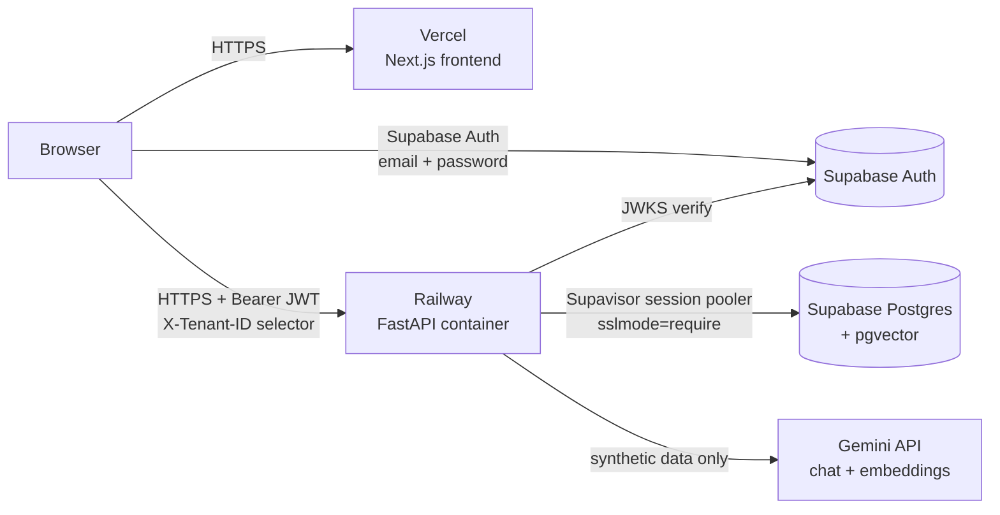

# Deployment readiness (Railway + Supabase + Vercel)

> **Status: prepared, not deployed.** Nothing in this repository has been deployed, no
> hosted resource has been created and no secret exists in the repo. This runbook is what an
> operator follows to deploy the portfolio demo. All data is **synthetic**.

## Topology



| Piece | Host | Notes |
| --- | --- | --- |
| Frontend | Vercel, root directory `frontend` | Next.js auto-detected; no `vercel.json` needed **(V)** |
| API | Railway, root directory `backend` | `backend/Dockerfile` (non-root, `$PORT`), `backend/railway.json` |
| Database | Supabase Postgres | pgvector enabled by migration `0003`; checkpoints by `setup_checkpoints` |
| Identity | Supabase Auth | backend verifies JWTs via JWKS; tenants from `tenant_memberships` |
| Inference | Gemini API | chat (`LLM_PROVIDER=gemini`) and embeddings (`EMBEDDING_PROVIDER=gemini`) |

## Environment variables (names only — set values in each host's secret store)

### Railway (API)

| Variable | Required in production | Value shape |
| --- | --- | --- |
| `APP_ENV` | yes | `production` |
| `DATABASE_URL` | yes | Supabase **session pooler** URL, port 5432, with `?sslmode=require` |
| `AUTH_MODE` | yes | `supabase` |
| `SUPABASE_URL` | yes | `https://<project-ref>.supabase.co` |
| `SUPABASE_JWT_AUDIENCE` | no | default `authenticated` |
| `SUPABASE_JWT_SECRET` | legacy HS256 projects only | prefer asymmetric JWKS keys |
| `PUBLIC_DEMO_ENABLED` | no | `true` enables "Try Live Demo" (needs Supabase anonymous sign-ins) |
| `PUBLIC_DEMO_TENANT_SLUG` | no | default `bluepeak-retail`; must exist or demo requests fail with 503 |
| `PUBLIC_DEMO_RATE_LIMIT_PER_MINUTE`, `PUBLIC_DEMO_GLOBAL_RATE_LIMIT_PER_MINUTE` | no | per anonymous visitor (default 5) and shared by all visitors (default 60) |
| `CORS_ORIGINS` | yes | the exact Vercel origin(s), `https://…`, comma-separated |
| `LLM_PROVIDER` | yes | `gemini` |
| `GEMINI_API_KEY` | yes | secret |
| `GEMINI_MODEL` | no | default in `app/core/config.py` |
| `EMBEDDING_PROVIDER` | yes | `gemini` |
| `GEMINI_EMBEDDING_MODEL`, `EMBEDDING_DIMENSIONS` | no | defaults `gemini-embedding-2`, `768` |
| `LANGSMITH_TRACING`, `LANGSMITH_API_KEY`, `LANGSMITH_PROJECT` | no | tracing is OFF by default |
| `PORT` | injected by Railway | the container listens on it |

`APP_ENV=production` refuses to start (and `scripts.check_env` fails) unless every
"required" row is satisfied: `DATABASE_URL` set, `DEBUG=false`, `AUTH_MODE=supabase` with an
https `SUPABASE_URL`, explicit https `CORS_ORIGINS` (no `*`), hosted chat and embedding
providers with `GEMINI_API_KEY`, and a LangSmith key if tracing is on. Only setting NAMES are
printed, never values.

### Vercel (frontend) — public, inlined at build time

| Variable | Value |
| --- | --- |
| `NEXT_PUBLIC_API_URL` | the Railway public URL, `https://…` |
| `NEXT_PUBLIC_AUTH_MODE` | `supabase` |
| `NEXT_PUBLIC_SUPABASE_URL` | `https://<project-ref>.supabase.co` |
| `NEXT_PUBLIC_SUPABASE_ANON_KEY` | the project's public anon / publishable key (never the service-role key) |

## Why the session pooler

Supabase's direct connection is IPv6 by default; the shared Supavisor pooler in **session
mode** (port 5432) works over IPv4 and supports prepared statements, which a long-lived API
container relies on. Transaction mode (port 6543) is for short-lived serverless clients and
does not support prepared statements. Use `sslmode=require` (or `verify-full` with the
project CA). Source: Supabase "Connect to your database" guide (checked Sept 2026).

## Operational assumptions

* **Trusted proxy.** The container starts uvicorn with `--proxy-headers
  --forwarded-allow-ips='*'` because it is reachable only through Railway's edge proxy, which
  terminates TLS and sets `X-Forwarded-*`. The application never makes a security decision
  from the client IP or `X-Forwarded-For` (identity = verified JWT; rate limit key = user +
  tenant), so a spoofed forwarded header cannot bypass anything. On a host where the
  container is directly reachable, set `--forwarded-allow-ips` to the proxy's address.
* **Logging.** JSON lines on stdout (Railway collects stdout): one `app.request` line per
  request (method, path without query string, status, duration, request id), plus run,
  action and error events; never prompts, model output, tokens, keys or connection URLs.
  `DEBUG=false` is enforced in production. Uvicorn's own start-up/access lines are plain text
  (P3).
* **Database TLS.** Put `sslmode=require` (or `verify-full` with the Supabase CA) in
  `DATABASE_URL`; both the SQLAlchemy engine and the checkpoint pool use the same URL.
* **pgvector.** Migration `0003` runs `CREATE EXTENSION IF NOT EXISTS vector`; on Supabase the
  `postgres` role may do this. If the project restricts it, enable **vector** once under
  *Database → Extensions* before the first deploy. Downgrades never drop the extension.
* **No local dependency at start-up.** Construction is network-free (models, embeddings,
  JWKS and the checkpoint pool are created lazily); `/health` answers without a database.
  Ollama is never needed in production (`LLM_PROVIDER`/`EMBEDDING_PROVIDER=gemini` enforced).
* **Live execution stream.** `POST /api/agent/messages/stream` and
  `/api/agent/actions/{id}/approve|reject/stream` answer `text/event-stream` with
  `X-Accel-Buffering: no`, `Cache-Control: no-store` and a comment heartbeat every 15 s, so an
  idle edge proxy keeps the connection open during a long model call. The browser calls the
  Railway API directly (not through a Vercel rewrite), so Vercel does not buffer it. Nothing
  new to configure; verify once on the deployed stack (P26). A disconnect never cancels a run.
* **Checkpoint retention.** No automatic TTL; completed threads stay until deleted
  (`delete_checkpoint_thread`). Prune deliberately if storage matters (P6).

## First-time runbook

1. **Supabase project** (free tier is enough). Copy the session-pooler connection string and
   the project URL. In *Authentication*, create the demo users (email + password) and note each
   user's id (UUID) — that is the JWT `sub`.
2. **Railway service** from this repo (native GitHub integration): branch `main`, root
   directory `backend`, config file path `/backend/railway.json` (Railway's config file path
   does not follow the root directory; it must be absolute), **autodeploy on**. Set the
   variables above. Recommended: enable *Wait for CI* so a commit whose GitHub Actions CI
   failed is not deployed (`docs/CI_CD.md`).
3. **Deploy** = push (merge) to `main`. Railway builds `backend/Dockerfile` and
   `railway.json` runs the pre-deploy step before the new container receives traffic — the
   only place migrations run:
   `python -m scripts.predeploy` = `check_env` → `alembic upgrade head` →
   `setup_checkpoints`. Any failure aborts the release and the previous deployment keeps
   serving. The healthcheck is `GET /health/ready`.
4. **Bootstrap the synthetic demo data once, from a trusted operator machine** (these tools
   refuse `APP_ENV=production` on purpose — the running service has no bulk-mutation path):

   ```bash
   cd backend
   export APP_ENV=staging DATABASE_URL='<session pooler URL>' \
          EMBEDDING_PROVIDER=gemini GEMINI_API_KEY='<key>'   # synthetic data only
   uv run python -m scripts.seed_demo          # two synthetic tenants
   uv run python -m scripts.ingest_policies    # synthetic policy corpus
   uv run python -m scripts.embed_policies     # hosted (gemini) embedding profile
   uv run python -m scripts.grant_membership --tenant northstar-commerce --subject <user-uuid> --role approver
   uv run python -m scripts.grant_membership --tenant bluepeak-retail   --subject <user-uuid> --role member
   ```

5. **Vercel project** from this repo (native Git integration): root directory `frontend`,
   production branch `main`, Node.js 22.x or 24.x (from `engines`; Node 20 is unsupported);
   set the four `NEXT_PUBLIC_*` variables in its **Production** environment. Every push to
   `main` deploys to production. Recommended: add the GitHub checks `backend`, `frontend`,
   `e2e`, `security` as *Deployment Checks* so a red commit is not promoted. Add the Vercel
   origin to Railway's `CORS_ORIGINS`.
6. **GitHub:** protect `main` (required checks `backend`, `frontend`, `e2e`, `security`; see
   `docs/CI_CD.md`). No GitHub secrets are needed.
7. **Smoke checks** (below).

## Public demo ("Try Live Demo") — manual Supabase steps

Code cannot switch these on; an operator does, once:

1. **Supabase Dashboard → Authentication → Sign In / Providers → enable *Anonymous
   Sign-Ins*.** Anonymous users get a normal `authenticated` JWT plus the claim
   `is_anonymous: true`, which the backend verifies (signature, issuer, audience) before
   trusting it.
2. **Railway:** set `PUBLIC_DEMO_ENABLED=true` (optionally `PUBLIC_DEMO_TENANT_SLUG`).
3. **Abuse protection (recommended):** keep Supabase's IP rate limit for anonymous sign-ins
   (Authentication → Rate Limits). Supabase recommends CAPTCHA / Cloudflare Turnstile for
   anonymous sign-ins; note that the frontend does not yet pass a CAPTCHA token, so enabling
   CAPTCHA requires adding the widget first (pending item P24). The API adds its own
   per-visitor and global demo message budgets.
4. **Cleanup:** anonymous users accumulate. Per Supabase guidance, delete old ones
   periodically (SQL editor), e.g.
   `delete from auth.users where is_anonymous is true and created_at < now() - interval '30 days';`
   The app stores no per-visitor rows except their own LangGraph checkpoint threads.

No `tenant_memberships` row is needed for anonymous visitors, and no service-role key is
used anywhere in the frontend.

## Smoke checks

```bash
API=https://<railway-domain>
curl -fsS $API/health                    # {"status":"ok",...}
curl -fsS $API/health/ready              # {"status":"ready","checks":{config,database,migrations,checkpoints: ok}}
curl -s -o /dev/null -w '%{http_code}\n' $API/api/me                               # 401 auth_required
curl -s -o /dev/null -w '%{http_code}\n' -H 'X-Tenant-ID: <any uuid>' $API/api/customers  # 401: header alone is never trusted
curl -s -o /dev/null -w '%{http_code}\n' -X OPTIONS -H 'Origin: https://evil.example' \
     -H 'Access-Control-Request-Method: POST' $API/api/agent/messages              # no allow-origin header
```

Live trace (no auth needed to see the refusal; with a token you see the events):

```bash
curl -N -s -X POST $API/api/agent/messages/stream -H 'Content-Type: application/json' \
     -d '{"text":"hi","thread_id":"smoke"}' -o /dev/null -w '%{http_code}\n'        # 401 before any stream
```

Then in the browser: sign in → the tenant selector shows only granted tenants → send a
question and watch the Agent Execution Trace fill in step by step while it runs → ask a
policy question (cited answer) → "cancel ORD-1004" → approve as the approver user → the
member user sees approve/reject disabled.

## Migrations

* Forward only in production: `alembic upgrade head` runs in the pre-deploy step.
  `downgrade` exists for local development and the migration round-trip tests; never run it
  against the hosted database.
* The readiness check compares `alembic_version` with the head revision shipped in the image,
  so a container never reports ready against a schema behind its code.
* Checkpoint tables belong to `langgraph-checkpoint-postgres` (self-versioned via
  `checkpoint_migrations`); `setup_checkpoints` is idempotent.
* Rollback = redeploy the previous image. Migrations 0004–0006 are additive (new tables, one
  relaxed CHECK), so the previous image keeps working on the newer schema.

## Local verification of the container contract

The image could not be built in the development sandbox (Docker Hub is blocked there). On a
machine with Docker:

```bash
cd backend
docker build -t commerceops-api:local .
docker run --rm -e PORT=8080 -p 8080:8080 commerceops-api:local &
curl -fsS localhost:8080/health                       # ok
docker run --rm commerceops-api:local id -u           # non-zero (non-root)
docker run --rm -e APP_ENV=production commerceops-api:local   # exits: invalid production configuration
```

The same `CMD` was verified in the sandbox by running it as an unprivileged user with a custom
`PORT` (health ok, readiness 503 without a database, production config refused at startup).

## Not done (out of scope for local completion)

No Railway/Supabase/Vercel resources were created, no deployment happened, no secrets were
generated or rotated, and no live Supabase/Gemini call was made. See
`docs/pending-items.md`.
