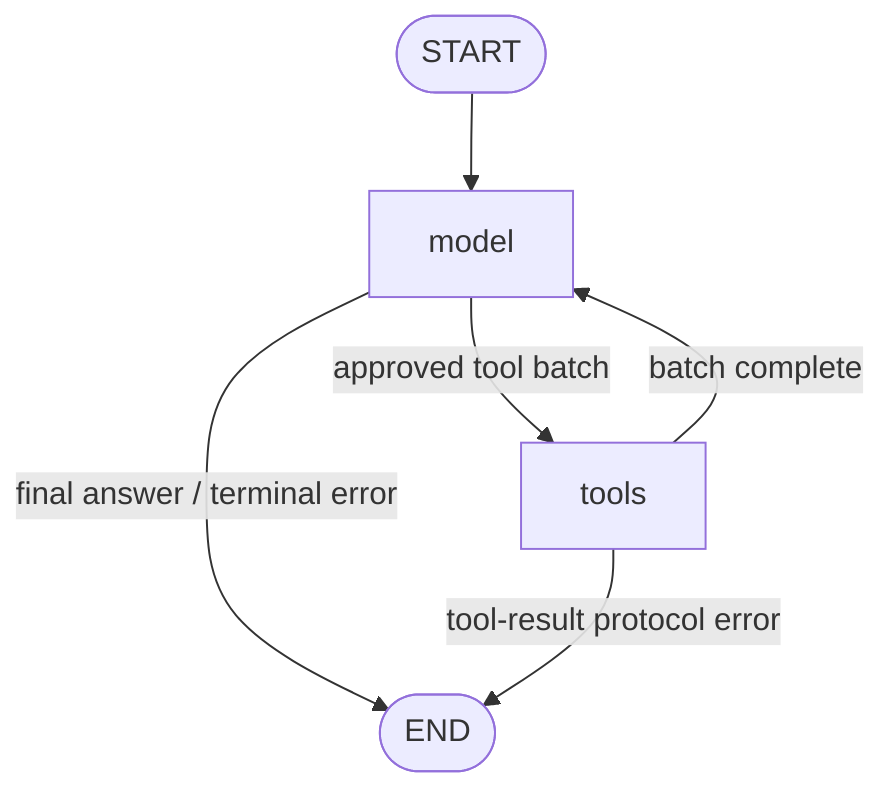

# Architecture notes

Current step: **Step 8 — embeddings and semantic retrieval.** Policy chunks are embedded
with local Ollama `nomic-embed-text-v2-moe`, stored with pgvector per concrete embedding
profile, and retrieved by exact cosine similarity next to the unchanged Step-7 lexical
baseline, with the same tenant, effective-date and citation rules. Retrieval only: no
hybrid ranking, no ANN index, no RAG answer generation; the assistants do not use the
knowledge base yet. No durable persistence, long-term memory or human approval yet.

| Concern | Where it lives |
| --- | --- |
| Structured business data | PostgreSQL (7 tables, Alembic migration `0001`) |
| Access to that data | `app/services` tenant-scoped query classes (read-only) |
| Agent-facing capabilities | `app/agent/tools` — 12 typed, read-only LangChain tools, bound to the model by the assistant |
| Tool-calling loop | `app/agent/assistant` — explicit, bounded, sequential (Step-5 reference / parity oracle) |
| Graph orchestration | `app/agent/graph` — LangGraph `StateGraph` (model / tools nodes), same limits and result contract |
| Language models | `app/agent/llm` — provider-neutral layer over Ollama (local) and Gemini (hosted) |
| Policy knowledge | `app/knowledge` + `knowledge_documents` / `knowledge_chunks` (migration `0002`) — lexical retrieval |
| Policy embeddings | `app/knowledge/embeddings` + `knowledge_chunk_embeddings` (migration `0003`, pgvector) — exact cosine retrieval |
| RAG answers / hybrid ranking | Not implemented yet |

## Backend layout (`backend/`)

| Module | Responsibility |
| --- | --- |
| `app/main.py` | `create_app()`: logging, CORS, request-context middleware, error handlers, routers |
| `app/core/config.py` | `Settings` (pydantic-settings) |
| `app/core/logging.py` | JSON-lines logging; adds `request_id` / `tenant_id` to every record |
| `app/core/request_context.py` | Context vars for request id and (claimed) tenant id |
| `app/core/tenant.py` | `TenantContext` — the only tenant input the services accept |
| `app/core/errors.py` | `AppError` hierarchy with safe client messages |
| `app/db/session.py` | Lazy engine; `read_only_session()`, `unit_of_work()`, `get_read_session` |
| `app/models/` | SQLAlchemy models, enums, naming convention |
| `app/schemas/commerce.py` | Frozen Pydantic read models (what services and API return) |
| `app/services/` | `CustomerQueries`, `ProductQueries`, `OrderQueries`, `InvoiceQueries`, `ShipmentQueries`, `SummaryQueries`, facade `CommerceQueries`, `resolve_tenant_context` |
| `app/api/deps.py` | `X-Tenant-ID` → `TenantContext` (demo mechanism), clock, `Queries` dependency |
| `app/api/errors.py` | Uniform error envelope, 422/404/500 handlers |
| `app/api/middleware.py` | Request id, `X-Request-ID` response header, one access-log line per request |
| `app/api/routes/commerce.py` | Read-only `/api/...` endpoints |
| `app/agent/context.py` | `AgentContext(tenant_id, request_id)` + `create_agent_context()` (trusted boundary, checks tenant exists) |
| `app/agent/tools/schemas.py` | Model-visible input schemas (`extra="forbid"`, bounded limits, injected `runtime`) |
| `app/agent/tools/{customers,orders,invoices,shipments,products}.py` | The tools |
| `app/agent/tools/runtime.py` | Per-call execution: read-only session, error classification, logging |
| `app/agent/tools/envelope.py` | `{"ok", "data" \| "error"}` result envelope |
| `app/agent/tools/registry.py` | `build_commerce_tools()` — the explicit list of permitted tools |
| `app/agent/tools/invoke.py` | Direct invocation with a trusted context (CLI/tests) |
| `app/agent/llm/config.py` | `LLMConfig.from_settings()` — the configuration boundary (provider, model, key, timeout, retries) |
| `app/agent/llm/factory.py` | `get_llm_provider()` — the only place that knows Ollama vs Gemini |
| `app/agent/llm/provider.py` | `LLMProvider` protocol, `ChatModelProvider`, `RetryPolicy`, logging |
| `app/agent/llm/classify.py` | Provider/transport exceptions → typed `LLMError`s |
| `app/agent/llm/errors.py` | `LLMConfigurationError`/`LLMAuthenticationError`, `LLMUnavailableError`, `LLMTimeoutError`, `LLMOutputError`, `LLMInputError`, `LLMInternalError` |
| `app/agent/llm/intent.py` | `IntentAnalysis` schema + `analyze_intent()` (structured-output test vehicle) |
| `app/agent/prompts/intent.py` | Versioned prompt (`intent-v1`), separate from provider code |
| `app/agent/prompts/assistant.py` | Versioned assistant system prompt (`commerce-assistant-v1`) |
| `app/agent/assistant/assistant.py` | `CommerceAssistant.run(text, context)` — the tool-calling loop |
| `app/agent/assistant/executor.py` | `ToolExecutor` — registry allowlist, argument checks, trusted runtime injection |
| `app/agent/assistant/limits.py` | `AssistantLimits` (rounds / total calls / calls per turn) from settings |
| `app/agent/assistant/result.py` | `AssistantResult`, `ToolCallSummary`, `InvalidToolCallSummary` |
| `app/agent/assistant/errors.py` | `AssistantError` (`agent_*` codes; LLM failures keep their `llm_*` code) |
| `scripts/seed_demo.py` | Idempotent synthetic seed |
| `scripts/run_tool.py` | Developer-only CLI to run one registered tool without a model |
| `scripts/run_llm.py` | Developer-only CLI to run the structured intent analysis against a provider |
| `scripts/run_assistant.py` | Developer-only CLI to run the commerce assistant for one tenant |
| `app/agent/graph/state.py` | `CommerceGraphState` (TypedDict, `add_messages`), per-run reset, tenant-scoped thread key, `scope_digest` |
| `app/agent/graph/routing.py` | `evaluate_model_turn()` (pure checks) and the conditional-edge functions |
| `app/agent/graph/nodes.py` | `GraphNodes.model` / `GraphNodes.tools` (Step-4 provider, Step-5 `ToolExecutor`) |
| `app/agent/graph/builder.py` | `build_commerce_graph(provider, *, tools, limits, checkpointer=None)` |
| `app/agent/graph/runner.py` | `CommerceGraphAssistant.run(text, context, *, thread_id=None)` → `AssistantResult` |
| `scripts/run_graph_assistant.py` | Developer-only CLI for the LangGraph assistant (optional in-process thread) |
| `app/models/knowledge.py` | `KnowledgeDocument`, `KnowledgeChunk` |
| `app/knowledge/sources.py` | Policy loader: discovery, front matter, validation, path safety, version ranges |
| `app/knowledge/chunking.py` | `policy-section-v1` chunker, `ChunkingConfig` (+ `chunking_hash`) |
| `app/knowledge/ingest.py` | Atomic idempotent ingestion, deterministic ids, conflict detection |
| `app/knowledge/temporal.py` | `effective_date()` — date / aware datetime → UTC calendar date |
| `app/knowledge/citations.py` | Tenant-relative citations `policy://<key>/v<n>#chunk-<i>` |
| `app/knowledge/retrieval.py` | `KnowledgeRetriever` protocol, `LexicalPolicyRetriever` (`lexical-pg-fts-v1`) |
| `app/knowledge/evaluation.py` | Retriever-agnostic hit@k evaluation over `data/eval/policy_retrieval_cases.yaml` |
| `app/services/knowledge.py` | `KnowledgeQueries` — tenant-scoped document/chunk/effective-version/citation lookups |
| `scripts/ingest_policies.py`, `scripts/search_policies.py` | Developer-only ingestion and search CLIs (`--retriever lexical|semantic`) |
| `app/knowledge/embeddings/provider.py` | `EmbeddingProvider` protocol, `OllamaEmbeddingProvider` (`ollama.Client.embed`, `truncate=False`), digest resolution, retries, validation helpers |
| `app/knowledge/limits.py` | The single retrieval-limit definition (default 5, hard maximum 10) |
| `app/knowledge/embeddings/profile.py` | `EmbeddingProfile` (provider, model tag, model digest, dimensions, input version) |
| `app/knowledge/embeddings/inputs.py` | `policy-embedding-input-v1` document/query text (prefixes), input hash |
| `app/knowledge/embeddings/validation.py` | Count / dimension / finite / non-zero checks for every vector |
| `app/knowledge/embeddings/materialize.py` | Atomic, idempotent embedding materialization per profile |
| `app/knowledge/semantic.py` | `SemanticKnowledgeRetriever` (`semantic-pgvector-v1`) |
| `scripts/embed_policies.py`, `scripts/eval_retrieval.py` | Developer-only embedding materialization and retrieval evaluation CLIs |

## Domain model

```
tenants ─┬─< customers ─< orders ─┬─< order_items >─ products >─┐
         │                        ├─< invoices                  │
         │                        └─< shipments                 │
         └──────────────────────────────────────────────────────┘
```

- UUID primary keys (`gen_random_uuid()` server default, core PostgreSQL ≥ 13), `TIMESTAMPTZ`
  timestamps, `created_at` / `updated_at` on every table.
- Money is `NUMERIC(12,2)` / `Decimal`, serialised to JSON as strings.
- Statuses are `VARCHAR` + named `CHECK` constraints backed by Python `StrEnum`s (no native
  PG enums, so adding a status is a simple constraint swap in a migration).
- Human references (`customer_code`, `sku`, `order_number`, `invoice_number`,
  `shipment_number`) are unique **per tenant**; `tenants.slug` is globally unique.
- Customer email is indexed but deliberately not unique (shared/reused addresses exist).

### Tenant integrity (database-enforced)

1. Parents expose `UNIQUE (tenant_id, id)` (customers, products, orders).
2. Children reference them with composite FKs on `(tenant_id, <parent>_id)`:
   `orders → customers`, `order_items → orders` and `→ products`,
   `invoices → orders`, `shipments → orders`. `customers` / `products` reference `tenants`.
3. Because the child's own `tenant_id` is part of the FK, PostgreSQL rejects any row whose
   parent belongs to a different tenant — including re-pointing an existing row's
   `tenant_id`. This does not depend on application code being correct.
4. The `(tenant_id, id)` unique indexes double as the tenant-leading index for lookups, so
   no separate `tenant_id` indexes are needed.

### Lifecycle vs derived state

- Invoice status is lifecycle only: `pending | paid | cancelled`. **Overdue is derived**
  (`status = 'pending' AND due_at < now`) at read time; nothing needs a background job to
  keep it current. `is_overdue` is exposed on the invoice read model. "Unpaid" = pending.
- Contradictory states prevented by CHECKs (not a full state machine):
  paid ⇔ `paid_at` present; `due_at >= issued_at`; non-draft orders have `placed_at`;
  delivered shipments have `delivered_at`; only delivered/returned shipments may carry
  `delivered_at`; delivery not before shipping; `line_total = quantity × unit_price`;
  quantity > 0; money ≥ 0; ISO-4217-shaped currency.
- Shipment `delayed` is a **stored operational state** (carrier- or operations-reported),
  not a derived one. `delay_reason` is nullable even for `delayed` shipments (a delay can be
  known before its cause). A possible later *derived* flag such as
  `is_late = delivered_at IS NULL AND expected_delivery_at < now` is a different concept:
  it can be true without any carrier report, and a `delayed` shipment need not be late yet.
- Order status and shipment status are **not** coupled by database constraints. Consistency
  between them is an application/workflow rule, especially since an order may have several
  shipments.
- Order items: the line's own UUID identifies it. There is no (order, product) uniqueness —
  the same product may appear on several lines (price, discount, customisation,
  fulfilment, tax). Demo line ids derive from (tenant, order, line number), never the SKU;
  demo order `ORD-1010` (Northstar) lists `SKU-1005` on two lines.
- Order `total_amount` = Σ line totals is maintained by the writing code (today: the seed)
  and covered by tests, not by a trigger. Production systems may choose a stronger
  strategy (trigger, or computing totals in one write service) depending on write workflows.
- `updated_at` is maintained by SQLAlchemy on application-issued updates (no DB trigger).

### Indexes

Beyond the unique constraints: `customers (tenant_id, name)`, `(tenant_id, email)`;
`products (tenant_id, name)`; `orders (tenant_id, customer_id, placed_at)` (history, latest
order, and the composite FK), `(tenant_id, status)`, `(tenant_id, placed_at)`;
`order_items (tenant_id, order_id)` (order lines and the composite FK), `(tenant_id, product_id)`; `invoices (tenant_id, status, due_at)` (unpaid /
overdue), `(tenant_id, due_at)`, `(tenant_id, order_id)`; `shipments (tenant_id, status)`,
`(tenant_id, order_id)`. Name search uses `ILIKE` (user wildcards escaped); no `pg_trgm`
until a query requirement justifies it.

## Why structured facts use deterministic database tools, not RAG

Order status, invoice amount and shipment state are authoritative relational facts. They
must be exact, current and tenant-scoped, so they are queried from PostgreSQL by explicit
tenant-filtered queries. Retrieving them probabilistically from embeddings could return
stale, approximate or cross-tenant text. RAG (a later step) is reserved for unstructured
knowledge such as company policies; agent tools will call `app/services` for facts.

## Tenant context (demo) — NOT authentication

- `X-Tenant-ID: <uuid>` is read by exactly one dependency, `get_tenant_context`
  (`app/api/deps.py`). Missing/blank → `400 tenant_context_missing`; not a UUID →
  `400 tenant_context_invalid`; unknown tenant → `404 tenant_not_found` (one PK lookup in
  `resolve_tenant_context`).
- Anyone can send any tenant id: this is a demo mechanism for propagating tenant context,
  not a security boundary. Authenticated identity will later produce the same
  `TenantContext` by replacing that dependency; services do not change.
- A reference that exists only in another tenant returns the same 404 as one that exists
  nowhere.

## Service layer and transactions

- Query classes take `(session, TenantContext, clock)` in their constructor; the tenant is
  fixed for the object's lifetime, so no public method can run without it. Joins are on
  `(tenant_id, id)` and every statement filters by the tenant.
- They return frozen Pydantic read models (no ORM objects escape, no lazy loading after the
  session closes). Internal UUIDs and tenant ids are not exposed.
- **Transaction boundary: the caller owns it.** Query classes never `commit()` / `flush()`.
  - Reads: `read_only_session()` issues `SET TRANSACTION READ ONLY` and always rolls back —
    an accidental write fails in PostgreSQL. The API uses it per request.
  - Writes (today only the seed): `unit_of_work()` commits once on success, rolls back on
    error.
  - Future agent tools compose several queries inside one session/transaction the same way.
- Time-dependent derivations take an injectable clock (tests use a fixed one).

## Errors and logging

- Error envelope: `{"error": {"code", "message"}, "request_id"}`. Messages never include
  SQL, connection details, stack traces or other tenants' data; 422s list field locations
  without echoing input; unhandled errors return a generic 500 (traceback only in server
  logs).
- Every log line carries `request_id` (inbound `X-Request-ID` if well-formed, otherwise
  generated; echoed in the response) and the claimed `tenant_id` (only if it is a valid
  UUID). One access line per request: method, path (includes references such as
  `ORD-1001`), status, duration. Query strings and bodies are not logged.

## Seed data (synthetic)

`python -m scripts.seed_demo` — two tenants (Northstar Commerce / USD, BluePeak Retail /
EUR) that deliberately reuse `CUS-1001`, `ORD-1001`, `INV-1001`, `SHP-1001`, `SKU-1001`.
Rules: refuses `APP_ENV=production`; ids are UUID5 of the natural key; upserts conflict on
those ids only; it never deletes and never overwrites unrelated rows (a conflicting
non-demo natural key aborts the whole seed); unchanged rows are not rewritten. Dates are
fixed, so derived states such as "overdue" change as real time passes (by design).

## Structured Agent Tools

```text
Future LLM
   ↓  chooses a tool + business arguments only (customer_code, order_number, sku, query, limit …)
Typed Agent Tool          app/agent/tools   (schema validation, envelope, logging)
   ↓  ToolRuntime.context = AgentContext(tenant_id, request_id)  ← set by trusted host code
Tenant-scoped Service     app/services      (Step 2 query classes, no SQL in the tool layer)
   ↓  own read-only session per call (SET TRANSACTION READ ONLY, always rolled back)
PostgreSQL
```

**Packages:** `langchain==1.4.2` (pulls `langchain-core 1.6.4`; and, because `ToolRuntime`
is defined in `langgraph.prebuilt`, also `langgraph 1.2.12`, `langgraph-prebuilt 1.1.0`,
`langgraph-checkpoint 4.2.0`, `langgraph-sdk 0.4.5`, `langsmith 0.14.0`). The tools
import only `langchain.tools` (`tool`, `ToolRuntime`, `BaseTool`). Since Step 6 `langgraph` is a
direct dependency (same locked version) and a test enforces that only `app/agent/graph/`
imports it.

**External tracing is opt-in.** `langsmith` is installed as a dependency but nothing enables
it; `LANGSMITH_TRACING=false` is the documented default. LangSmith reads it from the
*process* environment (export it, or set it on the host such as Railway) — pydantic-settings
does not export `.env` values. Enabling tracing (and adding an API key) is a deliberate
decision for the observability step, because traces would leave the machine.

**Tools (12, all read-only):** `get_customer`, `search_customers`, `get_order`,
`list_customer_orders`, `get_latest_customer_order`, `get_invoice`,
`get_latest_unpaid_invoice`, `get_shipment`, `get_order_shipments`,
`list_delayed_shipments`, `get_product`, `search_products`. `build_commerce_tools()` is the
single, explicit registry; it refuses to build if the list drifts.

**Inputs.** Pydantic schemas with `extra="forbid"`: identifiers are trimmed, 1–32 chars,
`[A-Za-z0-9][A-Za-z0-9._-]*`; search text 1–100 chars; `limit` defaults to 5, max 20. No
offset, ordering, column names or filter expressions. `runtime: ToolRuntime[AgentContext]`
is declared on the schema so LangChain strips it from the model-facing schema; a validator
accepts only a real injected `ToolRuntime` instance, so it cannot be forged from JSON.

**Outputs.** Every tool returns a structured, JSON-compatible dict envelope:
`{"ok": true, "data": …}` or `{"ok": false, "error": {"code", "message"}}`. Objects reuse the
Step 2 read models (money as strings, ISO-8601 datetimes); lists are
`{"items", "count", "has_more"}` (one extra row is fetched to set `has_more`); a valid query
with nothing to report (e.g. no unpaid invoice) is `{"ok": true, "data": null}`. When a tool
is called with a ToolCall, LangChain serialises the dict to JSON text in the `ToolMessage`
the model reads. The single exception is argument validation: LangChain's
`handle_validation_error` callback must return `str`, so that boundary returns the *same*
`{ok, error}` envelope already serialised to JSON.

**Errors.** Expected: `<resource>_not_found` (identical for "exists in another tenant" and
"does not exist"), `invalid_arguments` (field names and error types only, input never
echoed). Infrastructure: `service_unavailable` (database unreachable/not configured),
`internal_error` (anything else, including a missing/forged runtime or wrong context type).
Exception text never reaches the model; logs carry exception *type* only.

**Logging.** One `app.agent.tools` line per call: `tool`, `tenant_id`, `request_id`,
`outcome`, `error_code`, `duration_ms`. No payloads, prompts or record contents.

**Sessions.** Each invocation opens its own read-only session via the injected
`ToolDependencies.session_scope` (default `read_only_session`) and closes it before
returning, so concurrent tool calls never share a SQLAlchemy session. Tools are synchronous
(a future graph runs them in a thread pool).

### Why no direct SQL tool?
The model receives narrow business capabilities, not database access. A `run_sql` /
`query_database` / generic HTTP tool would bypass tenant scoping, read-only guarantees and
input validation, and make behaviour impossible to test exhaustively. Adding a capability
means adding one reviewed tool to the registry.

### Why is the tenant ID hidden from the model?
Tenant identity is an authorization/runtime concern, not something the model may select.
It is set by trusted code (the CLI today, authenticated requests later) in
`ToolRuntime.context`; model-visible schemas contain no tenant or request fields, and a
smuggled `tenant_id` argument is rejected as `invalid_arguments`. Tenant existence is
checked once at the context-creation boundary (`create_agent_context`), not per tool call.

### Why are structured facts not RAG?
Orders, invoice amounts and shipment state are authoritative relational records. They must
be exact, current and tenant-scoped, so tools read them through deterministic queries rather
than retrieving text by similarity.

### Why test tools without an LLM?
Tool correctness (right data, right tenant, bounded, safe errors) and agent reasoning are
separate concerns. Testing tools deterministically first means later agent failures can be
attributed to reasoning, not to data access.

## LLM Provider Layer

```text
                 LLMProvider (protocol)
                 /           \
             Ollama          Gemini
         local, free       hosted demo
      (langchain-ollama) (langchain-google-genai)
                 \           /
      ChatModelProvider: structured output, timeout, retry, safe errors, logging
                     ↓
           future agent orchestration (not built yet)
```

**Packages:** `langchain-ollama==1.1.0` (`ollama 0.6.2`), `langchain-google-genai==4.4.0`
(`google-genai 2.25.0`, the consolidated Google GenAI SDK; plus `google-auth` and its
crypto dependencies). Both are imported only inside `factory.py`/`classify.py`; a test
enforces that no other module imports a provider SDK.

**Interface.** Callers use `get_llm_provider(settings)` and the `LLMProvider` protocol
(`info`, `invoke_structured(schema, messages, operation=, prompt_version=)`). One concrete
`ChatModelProvider` wraps any LangChain chat model — there is no provider class hierarchy.
Model-specific parameters stay in the factory:

| | Ollama | Gemini |
| --- | --- | --- |
| Default model | `qwen3:4b-instruct` (Qwen3-4B-Instruct-2507, non-thinking; any Ollama model selectable via `OLLAMA_MODEL`, e.g. `llama3.2:3b`) | `gemini-3.8-flash` |
| Sampling | `temperature=0`, `num_predict=512` | model defaults (Gemini 3 guidance: don't override temperature) |
| Thinking | nothing forced (no `think` in requests): the default is a non-thinking model; `think` may be rejected by models without thinking support and cannot make a thinking-only model (e.g. `qwen3:4b` = `qwen3:4b-thinking`) non-thinking — pick a non-thinking model instead. Reasoning text is never stripped from answers as a workaround | `thinking_level="low"` for `gemini-3*` models only (lowest level 3.8 Flash supports); omitted otherwise |
| Timeout | `httpx.Timeout(LLM_TIMEOUT_SECONDS)` | `timeout=LLM_TIMEOUT_SECONDS` |
| Library retries | none | `max_retries=1` (= single attempt in the Google SDK; `0` would mean "SDK default") |
| Construction | `validate_model_on_init=False` — no network | key passed explicitly — no network, no implicit env lookup |

**Configuration boundary.** `LLMConfig.from_settings()` rejects unknown providers
(“Supported: ollama, gemini”), invalid model names, non-http(s) `OLLAMA_BASE_URL`, and
`gemini` without a non-blank `GEMINI_API_KEY` — before any client is built. Messages never
contain the key. `LLM_TIMEOUT_SECONDS` is 1–300 seconds (default 60, generous for a cold local
model); `LLM_MAX_RETRIES` is 0–2 (default 1).

**Structured output.** `with_structured_output(..., method="json_schema",
include_raw=True)` — native JSON-schema output on both providers. The schema sent to the
provider is the Pydantic schema without keywords outside the portable subset
(`minLength`/`maxLength`/`pattern`, which Gemini does not document). Every response is
then re-validated locally against the full `IntentAnalysis` model (`extra="forbid"`,
intent enum, ≤ 10 entities of 1–64 chars, confidence 0–1). A parse failure, empty
response or schema violation is `llm_output_invalid`.

`IntentAnalysis` is a **test vehicle** proving validated structured output — not the future
router. Input is 1–2,000 characters and wrapped in `<message>` tags; the prompt tells the
model to treat it as data.

**Errors** (`code`, safe `message`; raw provider text never propagated, exception chains
suppressed):

| Error | Codes | Retried |
| --- | --- | --- |
| `LLMConfigurationError` | `llm_not_configured`, `llm_model_not_found` (e.g. Ollama model not pulled → hint `ollama pull <model>`) | no |
| `LLMAuthenticationError` | `llm_auth_failed` (401/403) | no |
| `LLMUnavailableError` | `llm_unavailable` (connection, 5xx), `llm_rate_limited` (429) | yes |
| `LLMTimeoutError` | `llm_timeout` | yes |
| `LLMOutputError` | `llm_output_invalid` | no |
| `LLMInputError` | `llm_input_invalid` | no (never sent) |
| `LLMInternalError` | `llm_internal_error`, `llm_request_rejected` | no |

Classification uses LangChain's provider-neutral `ModelError` hierarchy first (the Gemini
integration raises it), then SDK status codes (`ollama.ResponseError`,
`google.genai.errors.APIError`), then transport errors.

**Retry policy.** Only `llm_timeout` / `llm_unavailable` / `llm_rate_limited`, at most
`LLM_MAX_RETRIES` (default 1), exponential backoff 0.5 s → 1 s (± 20 % jitter, cap 4 s).
Configuration, authentication, model-not-found, invalid-request and invalid-output errors
are never retried. Retrying is safe here because the call has no side effects; once
tools are bound, retries must stay at the model-call level and never re-run actions.

**Logging.** One `app.agent.llm` line per attempt outcome: provider, model, operation,
prompt version, outcome (`ok`/`retrying`/`error`), error code/type, attempts, input length,
duration. Never keys, prompts or model responses.

**Data.** The hosted demo uses Gemini with **synthetic demo data only**; no real customer,
employer, client (e.g. Brandhub) or other confidential data may be sent to the (free) API.
The hosted backend never needs Ollama; no model artifacts go into the Docker image.

**Live tests.** `tests/integration/test_llm_live.py` (opt-in via `RUN_OLLAMA_INTEGRATION=1` /
`RUN_GEMINI_INTEGRATION=1`) are provider *compatibility* smoke tests: the call succeeds,
native structured output validates as `IntentAnalysis` (allowed intent, entity bounds,
confidence 0–1), metadata is correct, and a missing Ollama model / rejected Gemini key
surface as safe typed errors. They deliberately do not assert which intent a model picks;
semantic quality belongs to the later evaluation framework.

### Why a provider abstraction?
Local development runs free on Ollama; the hosted demo uses Gemini; the agent and tool
layers stay provider-neutral, so switching is a configuration change.

### Why are tools not bound yet?
The model layer is validated on its own, so model failures (timeouts, invalid output) can
be distinguished from tool/data failures when the agent is introduced.

### Why structured output?
Downstream code needs validated, machine-readable decisions rather than parsing free text.

## Model-Driven Tool Calling

```text
User
 ↓
LLM (tools bound: exactly build_commerce_tools())
 ↓ AIMessage.tool_calls  (business arguments only)
ToolExecutor  — registry allowlist, argument checks, trusted AgentContext → ToolRuntime
 ↓
Typed Step 3 tool  (schema validation, envelope, per-tool log)
 ↓
Tenant-scoped service
 ↓
PostgreSQL
 ↑
ToolMessage (same tool_call_id, {ok, data|error} envelope)
 ↑
LLM
 ↓
Final answer  → AssistantResult
```

**Provider interface.** `LLMProvider.invoke_chat(messages, tools=..., operation=,
prompt_version=)` binds the tools (`bind_tools`) inside `ChatModelProvider` and returns the
provider's `AIMessage` unchanged, using the same Step 4 retry/classification/logging. The
assistant never branches on provider.

**Loop algorithm** (`CommerceAssistant.run`, a plain `for` loop — no recursion):

1. Validate the trusted `AgentContext` and the input (1–4,000 chars). Messages start as
   `[system(commerce-assistant-v1), user]`. The tenant is never put into messages.
2. For each round (≤ `max_model_rounds`): call the model with the registry bound.
3. `AIMessage.invalid_tool_calls` (unparseable model output) → record a sanitised summary,
   execute nothing, fabricate no ToolMessage, stop with `agent_protocol_error`.
4. No tool calls → the answer is `AIMessage.text` (text blocks only — reasoning/thinking
   blocks are never returned); empty → `agent_empty_answer`. Text that is a tool-protocol
   artifact — a bare `{}` / `[]`, a standalone JSON pseudo call (`name` plus
   `parameters`/`arguments`/`args`, optionally fenced or in a list), or
   `<tool_call>`/`<function_call>` markup — is **not** an answer and is **never parsed for
   execution**: it is recorded (`textual_tool_call` / `empty_structured_output`, with the
   attempted name) and the run ends with `agent_protocol_error`. Tools run only from
   LangChain's parsed `AIMessage.tool_calls`; ordinary JSON-looking text is left alone.
5. Any call without an id, or with a repeated id → `agent_protocol_error`.
6. Budgets are checked for the **whole batch** before anything runs: more than
   `max_tool_calls_per_turn`, or exceeding the remaining `max_tool_calls`, or requesting
   tools in the last allowed round → `agent_limit_exceeded`; no partial batch.
7. Append the **original** `AIMessage` object once (provider metadata such as Gemini 3
   thought signatures must survive), execute every call of the batch **sequentially**,
   append the ToolMessages in call order, and only then call the model again.

**Limits** (trusted settings only): `ASSISTANT_MAX_MODEL_ROUNDS=5` (≤ 10),
`ASSISTANT_MAX_TOOL_CALLS=8` (≤ 20), `ASSISTANT_MAX_TOOL_CALLS_PER_TURN=4` (≤ 8).

**Executor rules.** Lookup is an exact-name dict built from the registry — no imports,
`getattr` or reflection on model output. Unknown tool → `unknown_tool` ToolMessage, nothing
runs. Non-object arguments or a model-supplied `runtime` → `invalid_arguments`. Everything
else goes through the real tool (`tool.invoke(ToolCall)` with `make_runtime(context)`
injected), so schema validation (`extra="forbid"`, bounds) produces the standard
`invalid_arguments` ToolMessage with the original `tool_call_id`; a returned ToolMessage
whose id does not match is a host protocol error.

**Results.** `AssistantResult`: answer, provider, model, prompt version, model-call count,
`ToolCallSummary` list (round, tool, schema-declared business arguments only — truncated,
names of rejected arguments such as a smuggled `tenant_id`, outcome, error code, duration)
and duration. No reasoning, raw tool payloads, tenant ids or secrets. `AssistantError`
carries the same partial metadata for evaluation.

**Retries.** Step 4 retries apply to each model invocation independently. The host never
re-runs a tool: `order_not_found` or `invalid_arguments` is a business outcome fed back to
the model. Repeated identical calls requested by the model execute again and count toward
the limits (no silent deduplication).

**Sequential, not parallel.** Step 5 proves protocol correctness; parallel tool execution
can come later if measurements justify it.

**Logging.** One `app.agent.assistant` line per run: provider, model, prompt version,
tenant/request id (trusted server log), model calls, tool-call count, tool names, invalid
calls, outcome, duration. Never the user message, prompts, model output or tool payloads.
Step 3 per-tool log lines remain.

### Why a manual loop before LangGraph?
It separates (1) model/tool protocol correctness from (2) workflow orchestration and state
management, so failures are easier to locate.

### What LangGraph adds (Step 6)
See [LangGraph Orchestration](#langgraph-orchestration). The Step-5 loop itself is unchanged
and still persists nothing.

### Still missing
RAG / company policies, persistent conversation state, human approval, write tools,
evaluation framework, full observability.

## LangGraph Orchestration

Step 6 re-implements the Step-5 assistant as a LangGraph `StateGraph`
(`langgraph==1.2.12`, a direct dependency pinned to the already-locked version).

```
Step 5:  CommerceAssistant       → explicit Python loop       (kept: reference + parity oracle)
Step 6:  CommerceGraphAssistant  → StateGraph (model / tools)
```



The graph and the Step-5 loop share only lower-level pieces: the Step-4 provider,
the Step-3 tool registry, `ToolExecutor`, the prompt, `detect_protocol_artifact`,
`AssistantLimits` and the result models. The orchestration is written separately so the
parity tests compare two implementations. LangGraph is imported only under
`app/agent/graph/` (enforced by a test).

**State** (`CommerceGraphState`): `messages` (`add_messages` reducer — node updates append),
`scope_digest`, `pending` (approved AIMessage awaiting TOOLS), `model_calls`, `tool_calls`
and `invalid_tool_calls` (plain dicts), `seen_tool_call_ids`, `answer`, `error`. No sessions,
provider clients, settings, secrets, raw tenant IDs or raw thread IDs; durations are measured
by the runner.

**Runtime context.** `StateGraph(..., context_schema=AgentContext)` and
`graph.invoke(..., context=agent_context)`: nodes receive the same trusted `AgentContext`
via `Runtime[AgentContext]` and reject anything else. Runtime context is not checkpointed and
never enters messages, prompts or tool schemas (tests check messages, schemas and raw
checkpoint storage).

**MODEL node.** Checks `scope_digest`, calls `provider.invoke_chat(messages, tools=registry)`
(no Ollama/Gemini branching), keeps the provider's original `AIMessage`, counts the model
call, then records the result of `evaluate_model_turn()`:

1. `invalid_tool_calls` → `agent_protocol_error` (nothing executed, no ToolMessage fabricated);
2. parsed `tool_calls` → call ids present and unique, per-turn limit, total limit, final-round
   rule → approved batch stored in `pending` (visible text may be empty);
3. no tool calls → the Step-5 final-answer guard (empty, `{}`/`[]`, textual tool calls,
   `<tool_call>` markup) → answer appended, END.

A rejected turn is never appended to history. Conditional-edge functions only read the
recorded decision (LangGraph edges cannot write state).

**TOOLS node.** Executes the whole approved batch sequentially through `ToolExecutor`
(registry allowlist, trusted runtime injection, argument checks, sanitised summaries,
call-id checks, Step-3 logging) and then appends, in one update, the original AIMessage
followed by its ToolMessages in request order. No model call happens inside a batch.

**Limits.** The Step-5 settings stay authoritative (5 rounds / 8 total calls / 4 per turn,
hard caps 10 / 20 / 8). LangGraph's `recursion_limit` (`2 × rounds + 3`) is only a defensive
backstop; hitting it maps to `agent_limit_exceeded` / `recursion_limit`.

**Result.** `CommerceGraphAssistant.run()` returns the unchanged Step-5 `AssistantResult`
or raises the same `AssistantError`; graph state is never returned to callers.

**Parity.** 30 scripted scenarios (no tool, single/multi/two-round batches, invalid and
smuggled arguments, unknown tool, invalid tool calls, missing/duplicate ids, answer
artifacts, every limit, provider errors and retries, invalid input) run through both runners
and must match on outcome, counts, summaries, the exact messages sent to the model and DB
sessions opened. Two further parity cases run on real PostgreSQL.

### Checkpointing and threads (in-memory only)

`build_commerce_graph(..., checkpointer=None)`: one-shot by default. With LangGraph's
`InMemorySaver` a `thread_id` is required (1–64 chars `[A-Za-z0-9._-]`); without a
checkpointer it is rejected.

- **Tenant-scoped key.** The LangGraph `configurable.thread_id` is
  `cg1-<sha256(tenant_id + ":" + thread_id)>`, so the same caller thread name under two
  tenants is two unrelated threads.
- **`scope_digest`.** The first model step binds a sha256 fingerprint of the trusted tenant to
  the thread; a later run whose runtime context differs is refused
  (`agent_thread_conflict`) before any model call. Raw tenant and thread IDs are never
  checkpointed, logged or shown to the model (logs carry a 16-char `thread_key` prefix).
- **Continuation.** A new run on an existing thread appends only the new user message (the
  system prompt exists once per thread); `pending`, counters, summaries, seen call ids,
  answer and error reset per run, and limits apply per run.

- **Failed turns.** When a checkpointed run's user message is in the thread and the run
  ends in an application/graph error (provider error, protocol error, limit, tool-result
  protocol failure, recursion backstop), the runner closes the turn with a synthetic
  `AIMessage` whose text is always `The previous request could not be completed.` It is
  written with `update_state` as one extra checkpoint (earlier checkpoints of the run are
  kept), is not a model call and does not change `model_calls`, and carries no error code,
  exception text, provider/database detail or tenant data. The real code/detail stays in
  graph state `error` and in the raised `AssistantError`, which is unchanged. If a run died
  without closing its turn (e.g. a crash mid-batch), the next run on that thread inserts the
  same marker before the new user message. Invalid input writes nothing; a thread bound to
  another tenant is never written to; one-shot runs never touch checkpoint state.

A continued `InMemorySaver` thread is **ephemeral, thread-scoped short-term conversation
memory**: it survives multiple graph invocations only while that process and checkpointer
are alive, is lost on process restart, is not durable production memory, and is not
long-term or cross-thread user memory. Message history is not trimmed yet (pending P6).

### Why a custom tool node instead of LangGraph's `ToolNode`?
`ToolExecutor` is already the hardened capability boundary: registry allowlist, trusted
tenant injection, argument validation, unknown-tool handling, sanitised summaries, call-id
checks and safe logging. Replacing it now would move the security boundary for no gain.

### Where approvals will go
A later step can insert action-request → approval-interrupt → action-execution nodes on the
`model → tools` path. No `interrupt()`, approvals or write tools exist yet.

**Logging.** One `app.agent.graph` line per run: `runner=langgraph`, provider, model, prompt
version, tenant/request id (trusted server log), `checkpointed`, `thread_key` prefix, model
calls, tool-call count and names, invalid calls, `graph_steps`, outcome, detail, duration.
Never prompts, messages, model output, tool payloads, graph state or reasoning.

### Still missing after Step 6
RAG, a durable (PostgreSQL) checkpointer, history trimming, human approval, write actions,
evaluation and deeper observability.

## Knowledge / RAG foundation

```
backend/data/policies/<tenant-slug>/<document_key>.v<N>.md   (synthetic, front matter + Markdown)
   ↓  validated loader            (safe YAML, strict metadata, tenant + path checks, ranges)
   ↓  policy-section-v1 chunking  (heading-aware; size refinement only when needed)
   ↓  atomic idempotent ingestion
knowledge_documents / knowledge_chunks   (tenant-aware composite FK, no vector column)
   ↓  LexicalPolicyRetriever      (PostgreSQL FTS, tenant + as_of filter in the same SQL)
ranked, citation-ready chunks            (no LLM, no embeddings, not wired into the agent)
```

**Corpus.** Five fictional policies per tenant with identical document keys
(`shipping-policy`, `delayed-shipment-compensation`, `refund-policy`, `returns-policy`,
`order-cancellation`) and deliberately different rules (e.g. returns within 30 vs 14 days;
delay compensation after 3 business days vs 5 → 4). Northstar `refund-policy` and BluePeak
`delayed-shipment-compensation` have two versions each. Every file says it is fictional.

**Structured facts vs knowledge.** Exact, changing, per-record facts (an order total, an
invoice status) stay relational and go through commerce tools. Rules written as prose
("what is the cancellation policy?") are knowledge and go through retrieval.

**Versions and effective dates.** A version applies when
`effective_from <= as_of < effective_to` (`effective_to` NULL = open-ended), compared as UTC
calendar dates. A `date` is used as-is; a `datetime` must be timezone-aware and is converted
to UTC first; naive datetimes are rejected. Repositories never read the clock; the retriever
uses an injected clock only when `as_of` is omitted. Why version at all: policies change,
and a question about June must be answered from the policy effective in June.

- **Immutability.** `immutable_content_hash` is the sha256 of the **immutable policy
  payload** — tenant, key, title, type, version, `effective_from` and the body — and is
  therefore *not* a hash of the complete source file: it deliberately excludes
  `effective_to`, the one-time retirement field. The same (tenant, key, version) with a
  different `immutable_content_hash` (body, title or `effective_from` changed) is a
  `source_conflict`. The only permitted change to a stored version is **retirement**:
  `effective_to: null -> date`, once, when its successor is published. Changing or
  removing an already-set `effective_to` is a `source_conflict`.
- **Derived chunks.** Chunks are materialised by a recorded chunker (`chunker`,
  `chunking_hash` = chunker name + settings). Same source under a different chunker or
  settings is a `chunking_mismatch` — the document did not change, its derived chunks
  would. Automatic ingestion refuses to replace them; a future explicit re-chunk operation
  would rebuild them deliberately.
- **Overlap.** Ingestion rejects overlapping ranges (and versions that do not start after
  their predecessor) across the files **and** all stored versions. The database adds
  `version > 0`, `effective_to > effective_from` and a partial unique index allowing only
  one open-ended version per tenant/key. **The database alone does not prevent every
  overlap** of closed historical ranges (that would need a `btree_gist` exclusion
  constraint); the validated ingestion path maintains that invariant (tested).

**Chunking (`policy-section-v1`).** Split at ATX headings outside fenced code; each chunk
keeps its heading path (`Refund Policy > Refund timing`). A section that fits
`knowledge_chunk_max_chars` (default 1200, 200–4000) is one chunk. Only oversized sections
are packed from blank-line blocks (lists, tables, code stay whole), then sentences, then a
hard cut; optional `knowledge_chunk_overlap_chars` (default 0, ≤ 300) applies only between
pieces of one split section. There is no universally right size: too small loses context,
too large brings irrelevant text and lowers precision. With these short policies every
section is one chunk (51 chunks for 12 documents).

**Identity.** `document_id = uuid5(ns, tenant_id/key/v<version>)`,
`chunk_id = uuid5(ns, document_id/index/chunk_content_hash)`: stable while source and
chunking are unchanged; any content change changes the affected chunk's id.

**Ingestion** (`scripts.ingest_policies`, dev only; refuses `APP_ENV=production`): loads,
validates and chunks everything first; conflicts abort the whole run with no writes;
otherwise inserts new versions and retires predecessors in one transaction. It never
deletes rows (files removed from disk leave stored versions untouched). Logs: tenant id,
document key, version, outcome, chunk count — never content.

**Retrieval contract.** `KnowledgeRetriever.retrieve(query, context: AgentContext, *,
as_of=None, limit=5) -> RetrievalResult`; limit is 1–10 (hard maximum, otherwise rejected).
Each result: chunk id, citation, document key, title, version, section, chunk index,
effective dates, content, score, rank. No tenant ids or file paths.

**Lexical baseline (`lexical-pg-fts-v1`).** Why lexical first: a transparent,
deterministic baseline to prove the contract, isolation, version filtering and citations,
and a reference number Step 8 semantic retrieval must beat. The query is untrusted: at
most 500 characters and 32 distinct `[a-z0-9]+` terms survive (punctuation and operators
are discarded, the word "or" is dropped); they are joined as `t1 or t2 …` and bound as a
parameter to `websearch_to_tsquery('english', …)`. No terms → empty result without a
database call. Stop-word-only queries (`the`, `the and of`) survive the regex but lose every
term to PostgreSQL's English dictionary: a pre-check measures `numnode` of the built
tsquery and, at zero, returns an empty result without running the search (never a
fallback to unfiltered or rank-zero results; `lexeme_count` reports 0). Score =
`ts_rank_cd(setweight(title,'A') || setweight(section,'A') || setweight(content,'B'), q, 1)`
(title and heading words weigh more than body text; normalised by 1 + log(length)). Tenant and effective-version filters sit in the same SQL statement.
Order: score desc, document key, version desc, chunk index. Logs: retriever, tenant/request
id, as_of, query length, term count, result count, citations, duration — never query text
or content.

**Citations.** `policy://<document_key>/v<version>#chunk-<index>` — what the model will cite
later. They are **tenant-relative, not globally unique**: the same string names each
tenant's own chunk. Resolution (`KnowledgeQueries.get_chunk_by_citation`) only happens
inside a trusted tenant scope; a citation alone never performs a cross-tenant lookup.
Why citations: a future LLM answer must be traceable to source, version and chunk.

**Baseline evaluation** (`data/eval/policy_retrieval_cases.yaml`, 20 cases, expected chunk
per case; recorded in `data/eval/lexical_baseline_v1.json`, k = 3):

| Scope | document hit@1 | document hit@3 | chunk hit@1 | chunk hit@3 |
| --- | --- | --- | --- | --- |
| Northstar (10) | 1.00 | 1.00 | 0.40 | 0.80 |
| BluePeak (10) | 1.00 | 1.00 | 0.40 | 0.90 |
| All (20) | 1.00 | 1.00 | 0.40 | 0.85 |

Adding the title to the ranking vector moved two BluePeak shipping questions to the right
document at rank 1 (previously rank 2); chunk-level results did not change. The baseline
finds the right policy and version but often not the exact section, and it still misses
the exact chunk on vocabulary mismatches (BluePeak "express" vs its "Priority" option).
Each document's first chunk is the fictional-policy disclaimer; this retrieval
boilerplate may be reconsidered before or during vector indexing. The numbers are
recorded as-is, not tuned; a test fails if they drift so changes are deliberate.

## Embeddings and semantic retrieval (Step 8)

**Embeddings.** An embedding model turns text such as `"express delivery compensation"`
into a vector of 768 numbers so that texts with similar *meaning* get nearby vectors.
**pgvector** keeps those vectors inside PostgreSQL and compares them by cosine similarity,
so tenant, version and profile filters stay in the same SQL statement as the ranking.

```
Lexical  (lexical-pg-fts-v1):    matching words     "express" ≠ "Priority"
Semantic (semantic-pgvector-v1): matching meaning   "express delivery" ≈ "Priority 2–3 days"
```

**Provider.** `EmbeddingProvider` (`provider_name`, `model_name`, `dimensions`,
`resolve_model_digest()`, `embed_documents()`, `embed_query()`); Step 8 implements only
`OllamaEmbeddingProvider` over the official `ollama` client (0.6.2): one request path,
`Client.embed(model, input=[...], truncate=False, dimensions=<configured>)`, for documents
AND queries (a query is a one-element batch). `truncate=False` is explicit on every request
because Ollama would otherwise cut over-long inputs silently, and
`langchain_ollama.OllamaEmbeddings` does not expose that switch; an over-long input is
refused as `embedding_input_too_long`. Construction makes no request; the configured
`ollama_base_url` and the httpx timeout are applied to the client. Retries: only timeouts, connection
errors and Ollama 5xx, at most `embedding_max_retries` (default 1, cap 2). Stable errors:
`embedding_unavailable`, `embedding_timeout`, `embedding_model_not_found`,
`embedding_provider_error`, `embedding_count_mismatch`, `embedding_dimension_mismatch`,
`embedding_non_finite`, `embedding_zero_vector`, `embedding_input_too_long`,
`embedding_stale_conflict`,
`embedding_profile_not_materialized` — never raw server text. Settings are separate from
the chat model: `embedding_provider`, `ollama_embedding_model`
(`nomic-embed-text-v2-moe`), `embedding_dimensions` (768), `embedding_timeout_seconds`,
`embedding_batch_size` (16), `embedding_max_retries`.

**Concrete embedding profile.** `ollama/nomic-embed-text-v2-moe:latest@<digest>/768/policy-embedding-input-v1`
= provider, configured tag, **resolved model digest**, dimensions, input version. The
digest is part of the identity because `:latest` is mutable: a re-pulled build is a
different vector space. It is resolved from the local Ollama model list when an operation
needs embeddings (materialization, semantic retrieval) and cached per provider object. A new
digest is a new profile: old vectors stay, new vectors coexist, and a query vector is only
ever compared with document vectors of the same concrete profile. If the current profile
has no vectors for the tenant, semantic retrieval fails with
`embedding_profile_not_materialized` — never a fallback to another digest.

**Input representation (`policy-embedding-input-v1`).**
`search_document: Title: <title>\nSection: <section path>\n\n<chunk content>` for chunks
and `search_query: <query>` for queries (the model's task prefixes, applied in one module,
never by callers). No tenant ids, database ids, paths or citations. `input_hash` =
sha256 of the exact text. The model has a finite context (512 tokens); inputs are
**never truncated** — not in application code, and not by Ollama (`truncate=False`) — since
that would make the recorded hash lie. The chunker bounds chunk size, and the live test
proves every current chunk is accepted.

**Validation.** Every returned vector (documents and queries): correct count, exact
dimensions, finite numbers only (no NaN / ±inf / non-numeric), non-zero L2 norm (a zero
vector has no cosine direction). pgvector additionally rejects NaN at the database level.

**Storage.** `knowledge_chunk_embeddings` is separate from `knowledge_chunks`: chunks are
source-derived knowledge units, embeddings are model/version-dependent derived artifacts.
Columns: tenant, chunk, provider, model, model_digest, dimensions, input_version,
input_hash, `embedding vector` (generic, unsized, so later profiles may use other sizes),
created_at. Constraints: composite FK `(tenant_id, chunk_id)` → `knowledge_chunks(tenant_id,
id)` (so an embedding can never belong to another tenant's chunk), unique per chunk and
profile, `vector_dims(embedding) = dimensions`, dimensions 1–16000, format checks. ID =
`uuid5(chunk_id/profile key)`.

**Materialization** (`scripts.embed_policies`, dev only; refuses `APP_ENV=production`):
resolve the profile → read all chunks → build inputs → same profile + same input hash =
unchanged; same profile + different input hash = `embedding_stale_conflict` (abort before
any model call, nothing overwritten) → embed missing chunks in batches → validate → insert
in one transaction. Never deletes rows; other profiles are untouched. Logs: profile key,
counts, batches, batch size, outcome, duration — never vectors or content.

**Search (`semantic-pgvector-v1`).** Same contract as lexical: `retrieve(query, context,
*, as_of=None, limit=5)`, limit 1–10 (`app/knowledge/limits.py` is the single definition
used by both retrievers, the vector query boundary and the CLI), query trimmed and capped at 500 chars (empty → empty,
no provider call). One statement joins embeddings → chunks → documents with the tenant on
all three tables, the full concrete profile (provider, model, digest, dimensions, input
version) and the effective-date filter, orders by `embedding <=> :query` (pgvector cosine
distance) then document key, version desc, chunk index, and limits. Nothing is retrieved
globally and filtered afterwards. Query vectors are never stored. Score:
`cosine_similarity = 1 − cosine_distance`, in [−1, 1]; higher is more similar. It is not a
calibrated confidence or probability and is not comparable across profiles or with the
lexical `ts_rank_cd` score (`score_type` says which one a result carries). Citations are
the unchanged tenant-relative Step-7 form.

**Why no HNSW / IVFFlat yet.** Exact search over a tiny corpus gives the evaluation ground
truth without approximate-recall effects. ANN indexes become relevant with corpus growth
and should be introduced together with latency and recall measurements against exact
search.

**Why no RAG answer yet.** Step 8 measures retrieval on its own, independent of generation
quality. Hybrid lexical + semantic ranking is deliberately not built; it comes after both
baselines exist.

**Migration 0003 downgrade is asymmetric.** It drops the embedding table, its index and the
added `UNIQUE (tenant_id, id)` on chunks, but keeps the `vector` extension: `CREATE
EXTENSION IF NOT EXISTS` cannot prove this migration created it, and it may be shared
(e.g. pre-installed on managed PostgreSQL). Removing it is a deliberate manual action.

**Semantic baseline.** Recorded on a developer machine with Ollama in
`data/eval/semantic_baseline_v1.json` (provider, model, model digest, dimensions, input
version, cases and corpus fingerprints, metrics and per-case ranks — no vectors or exact
similarity values) via `scripts.eval_retrieval --retriever semantic --write …`.
Measured profile: `ollama/nomic-embed-text-v2-moe:latest@ff9c2f10…0965/768/policy-embedding-input-v1`
(full digest in the snapshot); all 51 chunks were accepted by the model without truncation
(first `embed_policies` run 51 embedded, second run 51 unchanged).

| Retriever (k = 3, all 20 cases) | document hit@1 | document hit@3 | chunk hit@1 | chunk hit@3 |
| --- | --- | --- | --- | --- |
| Lexical `lexical-pg-fts-v1` | 1.00 | 1.00 | 0.40 | 0.85 |
| Semantic `semantic-pgvector-v1` | 1.00 | 1.00 | 1.00 | 1.00 |

On the fixed 20-case synthetic evaluation corpus, semantic retrieval achieved exact-chunk
hit@1 of 1.00 versus 0.40 for lexical retrieval. Per case (exact-chunk rank): 12 semantic
wins, 8 ties, 0 losses. The deliberate vocabulary mismatch `bp-express-cost` (BluePeak
calls its fast option "Priority") moved from not-in-top-3 (lexical) to rank 1 (semantic).
This is a small, synthetic, fixed set written alongside the corpus; it is not evidence of
general retrieval accuracy, and nothing (model, chunking, cases) was tuned to it.
Growing the evaluation set is tracked as P8.

**Baseline integrity.** `tests/knowledge/test_semantic_baseline.py` checks the committed
snapshot offline: exact schema, provenance consistent with the configured provider, model
tag, dimensions, input version and chunker, the cases fingerprint and ids against the
current case file, aggregate metrics recomputed from the per-case ranks, no vectors or
scores, the 12/8/0 comparison with `lexical_baseline_v1.json`, and the express/Priority
case. `tests/db/test_semantic_baseline_corpus.py` checks the corpus fingerprint against a
fresh ingest. Recomputing the ranks with the real model stays opt-in
(`RUN_OLLAMA_INTEGRATION=1`, `tests/db/test_embeddings_live.py`), and is skipped when the
local model digest differs from the recorded one.

**Not implemented:** hybrid ranking, rerankers, ANN indexes, RAG answer generation, policy
tools for the model, LangGraph integration.

## Open items

Known follow-ups are tracked in [pending-items.md](pending-items.md).

## Testing

- Unit tests run without a database.
- Real-PostgreSQL tests need `TEST_DATABASE_URL` naming a database ending in `_test`; the
  session fixture runs `alembic downgrade base` → `upgrade head` → seed, and each test runs
  in a rolled-back transaction.
- Authoritative isolation proof: composite-FK rejection tests, service-level and API-level
  cross-tenant tests, shared references across tenants. A SQL-capture test checking that
  every statement is bound to the tenant id is a supplementary regression guard only.
